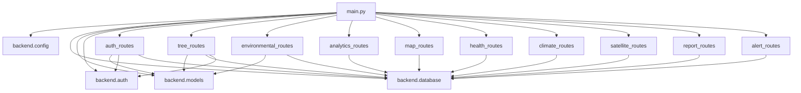
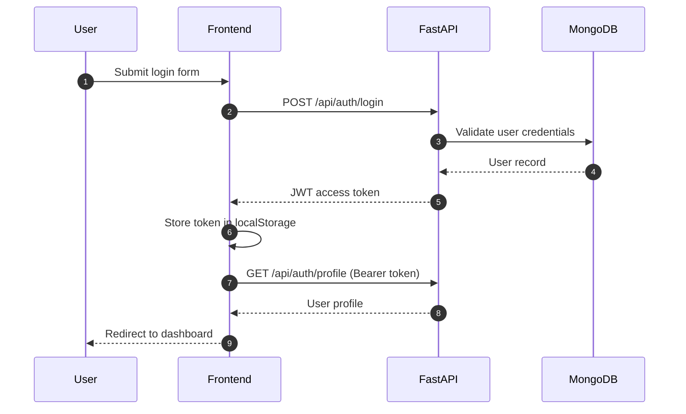
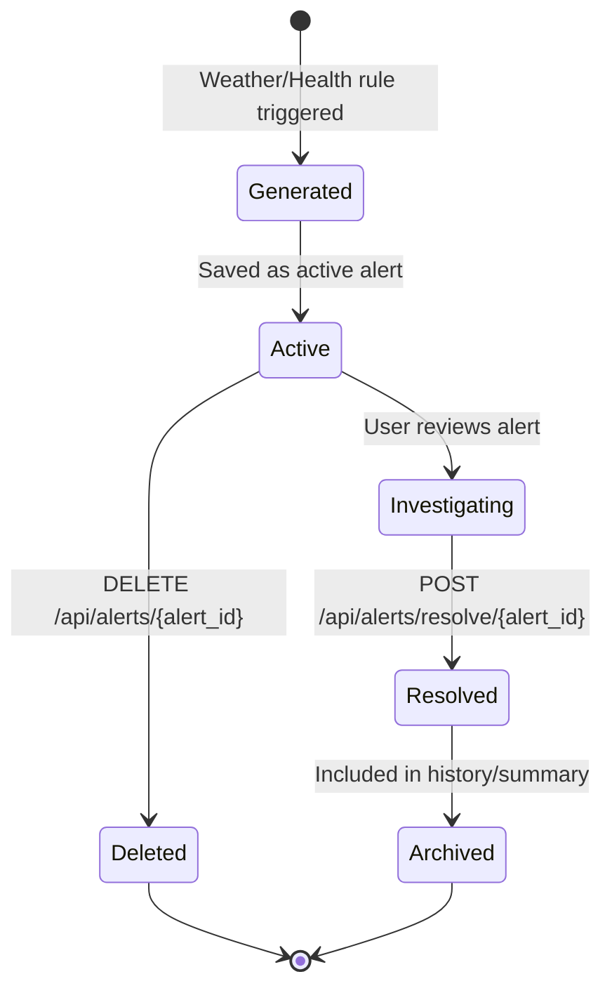
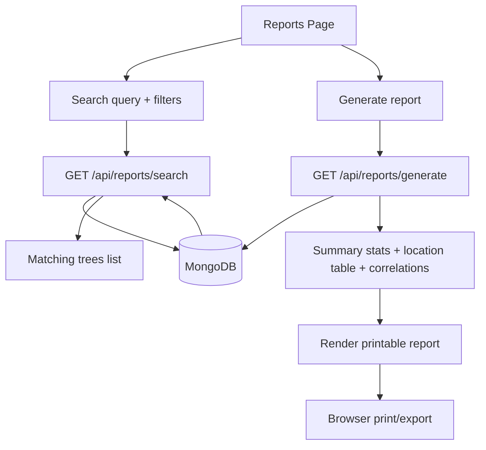
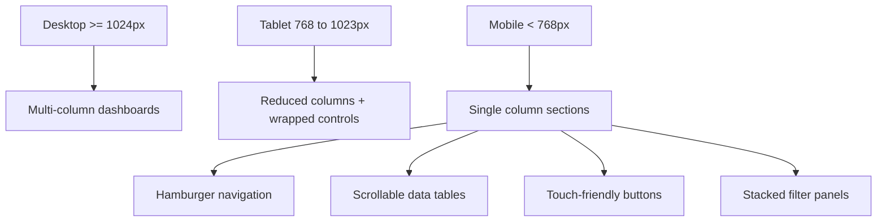

# Wild Tea Tree Platform Mermaid Diagrams

This file contains multiple Mermaid diagrams for the Wild Tea Tree Big Data Visualization Platform.

## 1) High-Level System Architecture

```mermaid
flowchart LR
    U[User Browser]\nHTML CSS JS --> FE[Frontend Pages]
    FE --> API[FastAPI App main.py]

    subgraph Backend
        API --> AR[auth_routes]
        API --> TR[tree_routes]
        API --> ER[environmental_routes]
        API --> ANR[analytics_routes]
        API --> MR[map_routes]
        API --> HR[health_routes]
        API --> CR[climate_routes]
        API --> SR[satellite_routes]
        API --> RR[report_routes]
        API --> ALR[alert_routes]
    end

    AR --> DB[(MongoDB)]
    TR --> DB
    ER --> DB
    ANR --> DB
    MR --> DB
    HR --> DB
    RR --> DB
    ALR --> DB

    CR --> OM[Open-Meteo API]
    SR --> NP[NASA POWER API]
```

## 2) Backend Route Dependency Map



## 3) Frontend Navigation / Page Relationship

```mermaid
flowchart TD
    IDX[/ index /] --> LOGIN[/ login /]
    IDX --> REG[/ register /]

    LOGIN --> DASH[/ dashboard /]
    REG --> DASH

    DASH --> TREES[/ trees /]
    DASH --> MAP[/ map /]
    DASH --> ANALYTICS[/ analytics /]
    DASH --> SAT[/ satellite /]
    DASH --> REPORTS[/ reports /]
    DASH --> ALERTS[/ alerts /]
    DASH --> UPLOAD[/ upload /]

    TREES --> DETAIL[/ tree/{id} /]
    TREES --> UPLOAD
    MAP --> DETAIL
    ALERTS --> DASH
    REPORTS --> DASH
```

## 4) Authentication Sequence



## 5) Tree Data CRUD and CSV Upload Flow

```mermaid
flowchart LR
    User[Researcher] --> TBL[Trees Page]
    TBL -->|Create/Edit/Delete| API1[/api/trees]
    TBL -->|Filter/List| API2[/api/trees?filters]
    TBL -->|Open Detail| TD[Tree Detail Page]

    TD --> IMG[Upload Image]
    IMG --> API3[/api/trees/{id}/images]

    UP[Upload Page] --> CSV[Drop CSV file]
    CSV --> API4[/api/trees/upload-csv]

    API1 --> MDB[(MongoDB)]
    API2 --> MDB
    API3 --> UPF[(uploads/ folder)]
    API3 --> MDB
    API4 --> MDB
```

## 6) AI Health Prediction Flow

```mermaid
flowchart TD
    A[Tree Detail Page] --> B[Upload tree image for health check]
    B --> C[POST /api/health/{tree_id}/check]
    C --> D[Health analysis module\ncolor/canopy metrics]
    D --> E[Compute score and grade]
    E --> F[Detect issues and recommendations]
    F --> G[Store health result in MongoDB]
    G --> H[Return score + issues + actions]
    H --> I[Display health result and history]

    I --> J[GET /api/health/{tree_id}/history]
    J --> K[Timeline of previous checks]
```

## 7) Climate and Satellite Integration Flow

```mermaid
flowchart LR
    TD[Tree Detail Page] --> LATLON[Tree coordinates]

    LATLON --> CL[GET /api/climate/tree/{tree_id}]
    CL --> OM[Open-Meteo API]
    OM --> CL
    CL --> UI1[Current weather + 7 day forecast]

    LATLON --> SAT[GET /api/satellite/vegetation/{tree_id}]
    SAT --> NP[NASA POWER API]
    NP --> SAT
    SAT --> UI2[Vegetation Health Index + badges]
```

## 8) Alert Lifecycle



## 9) Reporting and Search Workflow



## 10) Mobile Responsive Behavior Map


